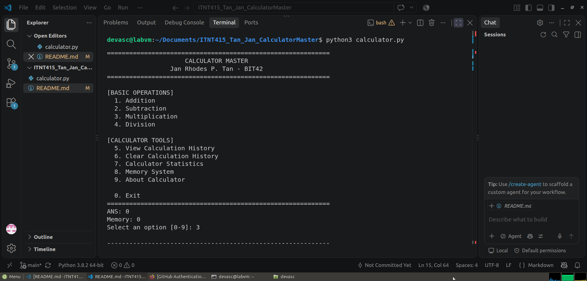

# Calculator Master

**Student Name:** Jan Rhodes P. Tan  
**Course:** S-ITNT415  
**Section:** BIT42  

## Project Description

Calculator Master is a menu-driven Python calculator developed using Git and GitHub branching. The project demonstrates Python programming, source code management, feature branching, meaningful commits, pull requests, merge operations, input validation, and error handling.

The final version expands the original four-operation calculator with additional tools while keeping the required arithmetic functions fully integrated.

## Branch Structure

The project was developed using the following feature branches:

- `addition_Tan` - Addition operation and input validation
- `subtraction_Tan` - Subtraction operation and input validation
- `multiplication_Tan` - Multiplication operation and input validation
- `division_Tan` - Division operation, input validation, and division-by-zero handling
- `enhancement_Tan` - Final interface redesign and additional calculator features

All completed feature branches were integrated into the `main` branch through GitHub pull requests and merge operations.

## Program Features

### Basic Operations
- Addition
- Subtraction
- Multiplication
- Division

### Input and Error Handling
- Numeric input validation
- Invalid menu selection handling
- Division-by-zero handling
- Continuous execution until the user exits

### Additional Features
- Calculation history
- Date and time stamps for calculation records
- Calculator usage statistics
- Previous result (`ANS`) functionality
- Calculator memory system
  - M+ - Add to memory
  - M- - Subtract from memory
  - MR - Recall memory
  - MC - Clear memory
- Automatic result formatting
- History clearing with confirmation
- Personalized About section

## Development Workflow

The calculator was developed incrementally using Git and GitHub.

1. Created the initial calculator skeleton on `main`.
2. Developed each required arithmetic operation on its own feature branch.
3. Used multiple meaningful commits during feature development.
4. Created pull requests for completed features.
5. Merged completed features into `main`.
6. Created `enhancement_Tan` for the improved final version.
7. Added history, statistics, memory, ANS, and an improved menu interface.
8. Reviewed and merged the enhanced calculator into `main`.

## Sample Execution

The final application provides a menu-driven terminal interface where users can perform calculations and access additional calculator tools.

## Technologies Used

- Python 3
- Git
- GitHub
- Visual Studio Code

## Developer

**Jan Rhodes P. Tan**  
S-ITNT415 - BIT42